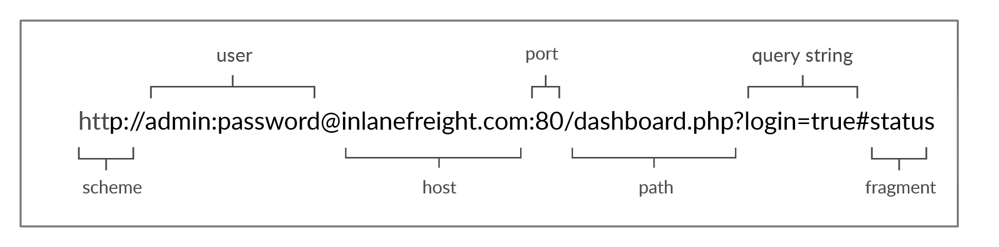
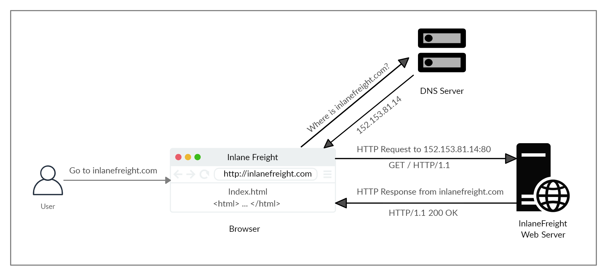

# HyperText Transfer Protocol (HTTP) — Learning

HTTP is an application-level protocol used to access the World Wide Web resources. The term hypertext stands for text containing links to other resources and text that the readers can easily interpret. HTTP communication consists of a client and a server, where the client requests the server for a resource. The server processes the requests and returns the requested resource. 

---

## URL

Here is what each component stands for:

| Component | Example | Description |
|---|---|---|
| **Scheme** | `http://` / `https://` | This is used to identify the protocol being accessed by the client, and ends with a colon and a double slash (`://`). |
| **User Info** | `admin:password@` | This is an optional component that contains the credentials (separated by a colon `:`) used to authenticate to the host, and is separated from the host with an at sign (`@`). |
| **Host** | `inlanefreight.com` | The host signifies the resource location. This can be a hostname or an IP address. |
| **Port** | `:80` | The `Port` is separated from the `Host` by a colon (`:`). If no port is specified, `http` schemes default to port `80` and `https` default to port `443`. |
| **Path** | `/dashboard.php` | This points to the resource being accessed, which can be a file or a folder. If there is no path specified, the server returns the default index (e.g. `index.html`). |
| **Query String** | `?login=true` | The query string starts with a question mark (`?`), and consists of a parameter (e.g. `login`) and a value (e.g. `true`). Multiple parameters can be separated by an ampersand (`&`). |
| **Fragments** | `#status` | Fragments are processed by the browsers on the client-side to locate sections within the primary resource (e.g. a header or section on the page). |

Not all components are required to access a resource. The main mandatory fields are the scheme and the host, without which the request would have no resource to request.

---

## HTTP Flow

The first time a user enters the URL (inlanefreight.com) into the browser, it sends a request to a DNS (Domain Name System) server to resolve the domain and get its IP. The DNS server looks up the IP address for inlanefreight.com and returns it. All domain names need to be resolved this way, as a server can't communicate without an IP address.

Once the browser gets the IP address linked to the requested domain, it sends a GET request to the default HTTP port (e.g. 80), asking for the root / path. Then, the web server receives the request and processes it. By default, servers are configured to return an index file when a request for / is received.

In this case, the contents of index.html are read and returned by the web server as an HTTP response. The response also contains the status code (e.g. 200 OK), which indicates that the request was successfully processed. The web browser then renders the index.html contents and presents it to the user.

