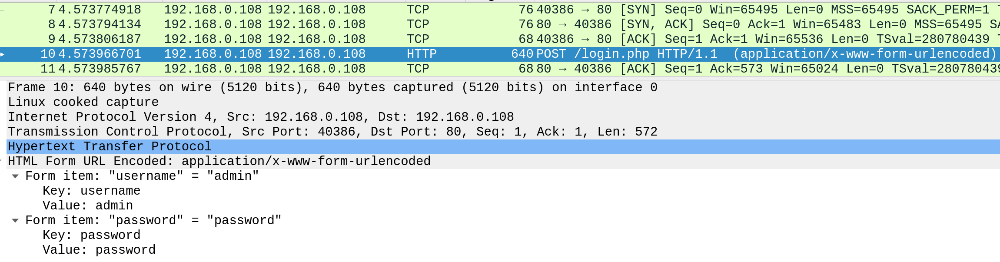
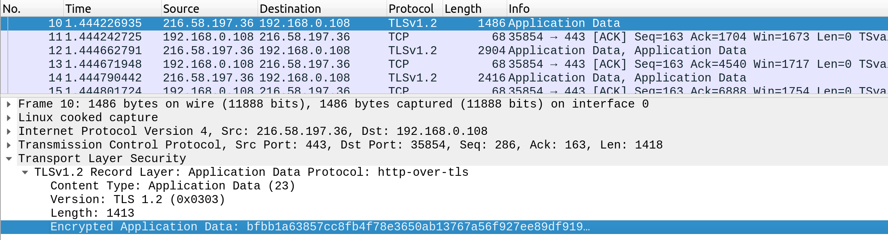
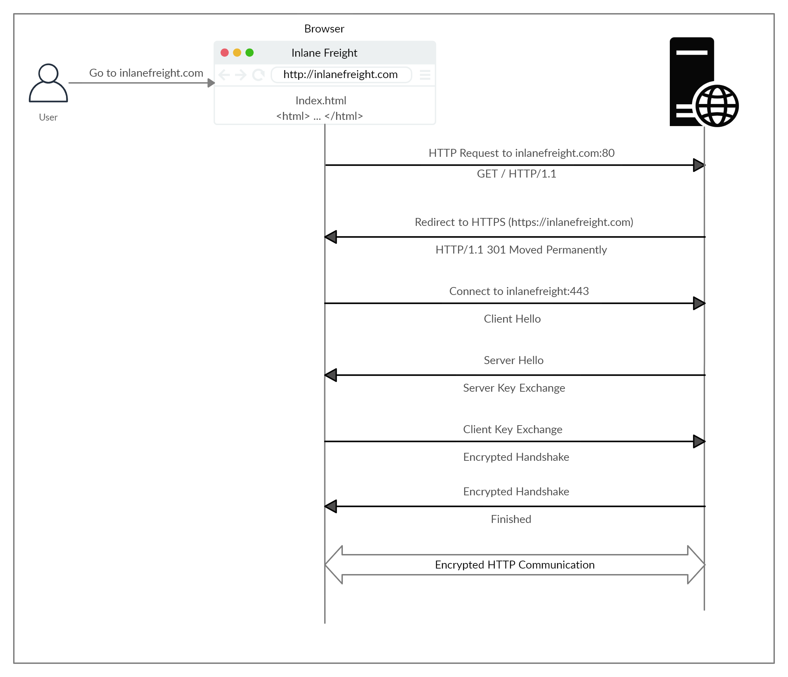

# Hypertext Transfer Protocol Secure (HTTPS) — Learning

In the previous section, we discussed how HTTP requests are sent and processed. However, one of the significant drawbacks of HTTP is that all data is transferred in clear-text. This means that anyone between the source and destination can perform a Man-in-the-middle (MiTM) attack to view the transferred data.

To counter this issue, the HTTPS (HTTP Secure) protocol was created, in which all communications are transferred in an encrypted format, so even if a third party does intercept the request, they would not be able to extract the data out of it. For this reason, HTTPS has become the mainstream scheme for websites on the internet, and HTTP is being phased out, and soon most web browsers will not allow visiting HTTP websites.

---

## HTTPS Overview

If we examine an HTTP request, we can see the effect of not enforcing secure communications between a web browser and a web application. For example, the following is the content of an HTTP login request:

We can see that the login credentials can be viewed in clear-text. This would make it easy for someone on the same network (such as a public wireless network) to capture the request and reuse the credentials for malicious purposes.

In contrast, when someone intercepts and analyzes traffic from an HTTPS request, they would see something like the following:

---

## HTTPS Flow

If we type http:// instead of https:// to visit a website that enforces HTTPS, the browser attempts to resolve the domain and redirects the user to the webserver hosting the target website. A request is sent to port 80 first, which is the unencrypted HTTP protocol. The server detects this and redirects the client to secure HTTPS port 443 instead. This is done via the 301 Moved Permanently response code, which we will discuss in an upcoming section.

Next, the client (web browser) sends a "client hello" packet, giving information about itself. After this, the server replies with "server hello", followed by a key exchange to exchange SSL certificates. The client verifies the key/certificate and sends one of its own. After this, an encrypted handshake is initiated to confirm whether the encryption and transfer are working correctly.

Once the handshake completes successfully, normal HTTP communication is continued, which is encrypted after that. This is a very high-level overview of the key exchange, which is beyond this module's scope.