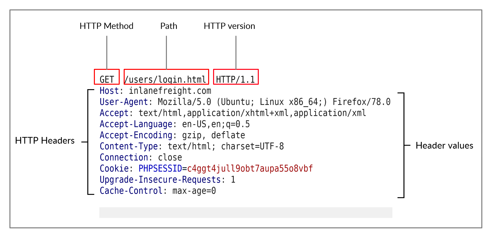
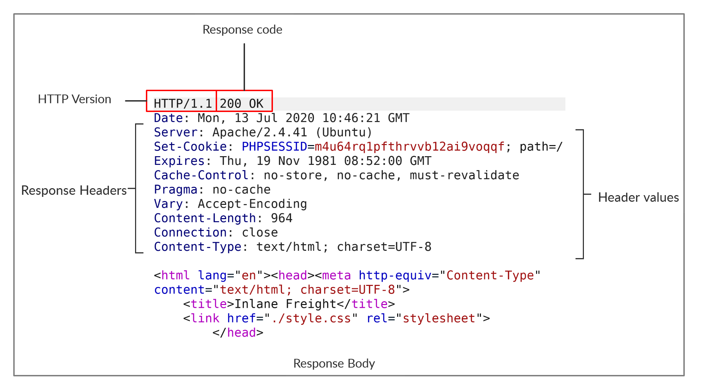

# HTTP Requests and Responses — Learning

HTTP communications mainly consist of an HTTP request and an HTTP response. An HTTP request is made by the client (e.g. cURL/browser), and is processed by the server (e.g. web server). The requests contain all of the details we require from the server, including the resource (e.g. URL, path, parameters), any request data, headers or options we specify, and many other options we will discuss throughout this module.

Once the server receives the HTTP request, it processes it and responds by sending the HTTP response, which contains the response code, as discussed in a later section, and may contain the resource data if the requester has access to it.

---

## HTTP Request

Let's start by examining the following example HTTP request:

The image above shows an HTTP GET request to the URL:

`http://inlanefreight.com/users/login.html`

The first line of any HTTP request contains three main fields 'separated by spaces':

| Field | Example | Description |
|---|---|---|
| **Method** | `GET` | The HTTP method or verb, which specifies the type of action to perform. |
| **Path** | `/users/login.html` | The path to the resource being accessed. This field can also be suffixed with a query string (e.g. `?username=user`). |
| **Version** | `HTTP/1.1` | The third and final field is used to denote the HTTP version. |

The next set of lines contain HTTP header value pairs, like Host, User-Agent, Cookie, and many other possible headers. These headers are used to specify various attributes of a request. The headers are terminated with a new line, which is necessary for the server to validate the request. Finally, a request may end with the request body and data.

> Note: HTTP version 1.X sends requests as clear-text, and uses a new-line character to separate different fields and different requests. HTTP version 2.X, on the other hand, sends requests as binary data in a dictionary form.

---

## HTTP Response

Once the server processes our request, it sends its response. The following is an example HTTP response:

The first line of an HTTP response contains two fields separated by spaces. The first being the HTTP version, and the second denotes the HTTP response code.

Response codes are used to determine the request's status. After the first line, the response lists its headers, similar to an HTTP request.

The response may end with a response body, which is separated by a new line after the headers. The response body is usually defined as HTML code. However, it can also respond with other code types such as JSON, website resources such as images, style sheets or scripts, or even a document such as a PDF document hosted on the webserver.