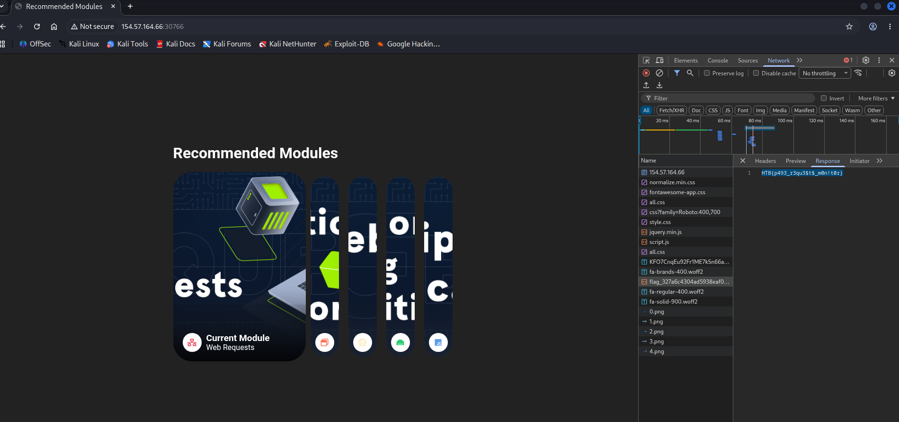

# HTTP Headers — Practice

The server above loads the flag after the page is loaded. Use the Network tab in the browser devtools to see what requests are made by the page, and find the request to the flag.

## Solve

