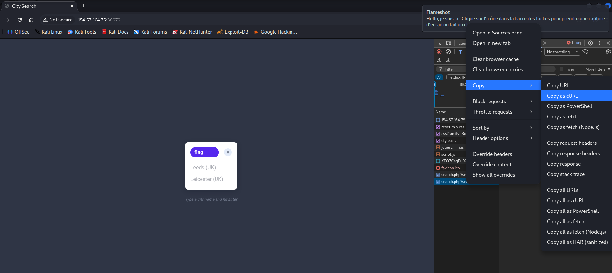

# GET — Practice

The exercise above seems to be broken, as it returns incorrect results. Use the browser devtools to see what is the request it is sending when we search, and use cURL to search for 'flag' and obtain the flag.

> Authenticate to 154.57.164.75 , with user "admin" and password "admin"

## Solve



Remove the user agent header and send the request : 

```bash
┌──(kali㉿kali)-[~]
└─$ curl 'http://154.57.164.75:30979/search.php?search=flag' \
  -H 'Accept: */*' \
  -H 'Accept-Language: en-US,en;q=0.9' \
  -H 'Authorization: Basic YWRtaW46YWRtaW4=' \
  -H 'Connection: keep-alive' \
  -H 'Referer: http://154.57.164.75:30979/'      
       
flag: HTB{curl_g3773r}
```