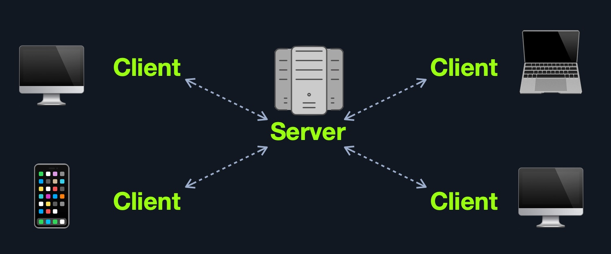
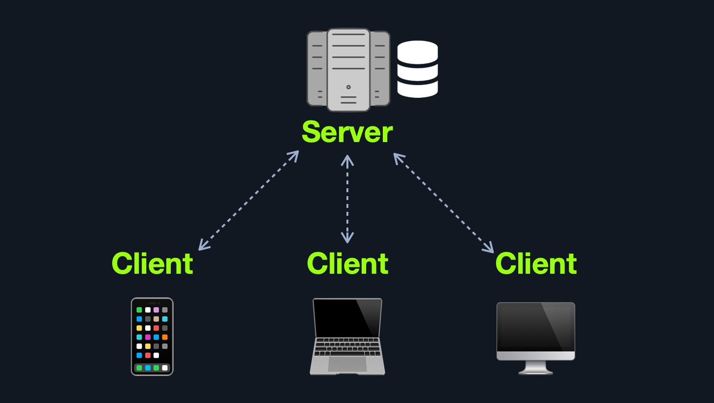
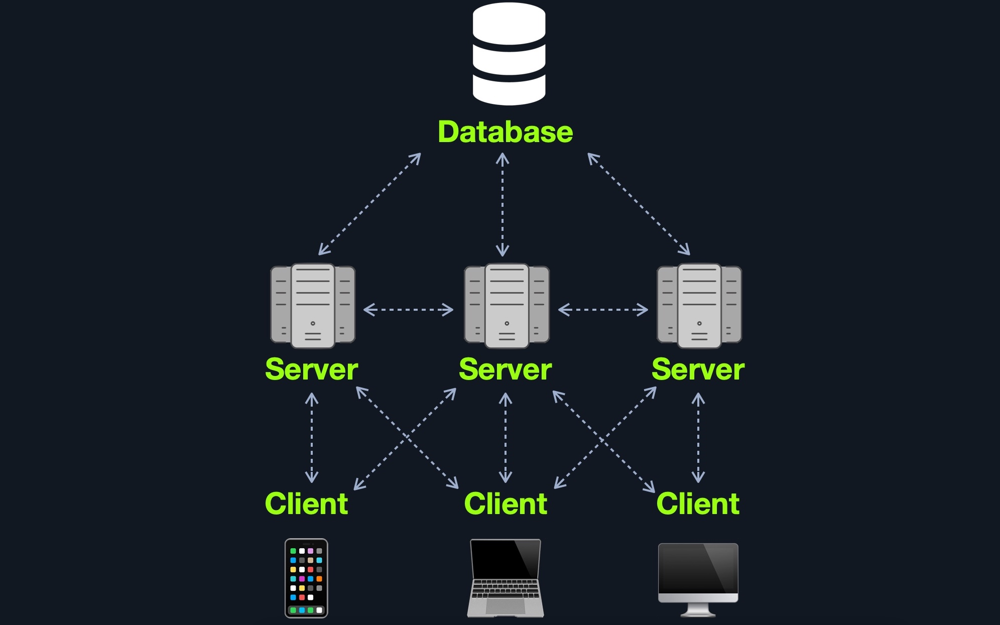
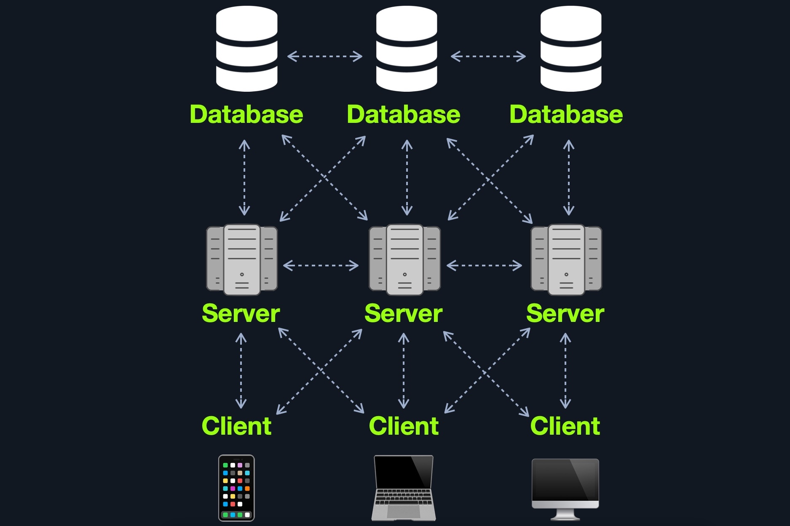

# Web Application Layout — Learning

Web applications can be designed and deployed in many different ways.

Their layout can generally be divided into three main categories:

- `Web Application Infrastructure` -> How servers, databases, and other backend components are organized.
- `Web Application Components` -> The elements used by the application, such as client, server, services, and functions.
- `Web Application Architecture` -> How all components interact with each other.

---

## Web Application Infrastructure

Common infrastructure models include:

- `Client-Server`
- `One Server`
- `Many Servers - One Database`
- `Many Servers - Many Databases`

---

### Client-Server

The client-server model separates the application into:

- **Client-side** -> Runs in the user's browser.
- **Server-side** -> Runs on the webserver.

Typical workflow:

```text
Client
  ↓ HTTP Request
Server
  ↓ Process Request
Database / Application Logic
  ↓
HTTP Response
  ↓
Client
```

The browser sends requests to the server, which processes them and returns the requested result.



---

### One Server

In this model, all application components are hosted on a single server.

This may include:

- Web application
- Webserver
- Database
- Multiple applications

Advantages:

- Simple architecture
- Easy to deploy

Disadvantages:

- Single point of failure
- Poor segmentation
- Compromise of one application may affect everything
- If the server goes down, all hosted applications become unavailable

This is essentially an:

```text
"All eggs in one basket"
```

architecture.



---

### Many Servers - One Database

In this model, web applications run on separate servers while sharing a central database.

Example:

```text
Web Server 1 ─┐
Web Server 2 ─┼──> Database Server
Web Server 3 ─┘
```

Advantages:

- Better segmentation
- Multiple applications can share the same data
- Compromise of one webserver does not automatically compromise the others
- Database is separated from the application servers

Access controls must still restrict each application to only the data it requires.



---

### Many Servers - Many Databases

This model further separates applications and databases.

Example:

```text
Web Server 1 -> Database 1
Web Server 2 -> Database 2
Web Server 3 -> Database 3
```

Applications may also share specific common data when required.

Advantages:

- Strong segmentation
- Better access control
- Better redundancy
- Reduced impact if one server or database is compromised
- Improved availability

This architecture may use components such as:

- Load balancers
- Backup servers
- Database replication



---

## Web Application Components

A web application can generally be divided into:

1. `Client`
2. `Server`
   - Webserver
   - Application Logic
   - Database
3. `Services`
   - Microservices
   - Third-party integrations
   - Application integrations
4. `Functions`
   - Serverless functions

---

## Web Application Architecture

Web applications commonly follow a **Three-Tier Architecture**.

### Presentation Layer

Responsible for the user interface.

Common technologies:

- `HTML`
- `CSS`
- `JavaScript`

This layer communicates directly with the client.

---

### Application Layer

Processes application logic and client requests.

Responsibilities may include:

- Authorization
- Privilege checks
- Input processing
- Business logic
- Communication with backend services

---

### Data Layer

Responsible for storing and retrieving data.

Typical components:

- Databases
- Data storage
- Database servers

General flow:

```text
Presentation Layer
        ↓
Application Layer
        ↓
Data Layer
```

---

## Microservices

Microservices divide a large application into smaller independent services.

Example for an online store:

- Registration
- Search
- Payments
- Ratings
- Reviews

Each microservice usually focuses on a specific task.

They communicate with:

- The client
- Other microservices
- Databases
- External services

Microservice communication is generally `stateless`, meaning each request is handled independently.

Advantages:

- Agility
- Flexible scaling
- Easier deployment
- Reusable code
- Resilience
- Different services can use different programming languages

---

## Serverless

Serverless architectures allow applications to run without the organization directly managing the underlying servers.

Common providers:

- AWS
- Azure
- GCP

The cloud provider handles:

- Server provisioning
- Scaling
- Maintenance
- Infrastructure management

Application code runs as functions or stateless workloads.

Advantages:

- Reduced infrastructure management
- Easier scaling
- Faster deployment
- Lower operational overhead

---

## Architecture Security

Security issues are not always caused by programming mistakes.

They may also result from poor architectural design.

Examples include:

- Weak segmentation
- Poor access control
- Missing `RBAC`
- Excessive privileges
- Poor separation between applications and databases

Example:

```text
Normal User
    ↓
Missing Authorization Check
    ↓
Admin Functionality
```

Another example:

```text
Compromised Web Server
    ↓
Database not found locally
    ↓
Database may exist on another server
```

This means that understanding the infrastructure can help identify:

- Additional servers
- Separate databases
- Internal services
- Trust relationships
- Potential lateral movement paths

Security should therefore be considered throughout the entire application development lifecycle, not only at the code level.

