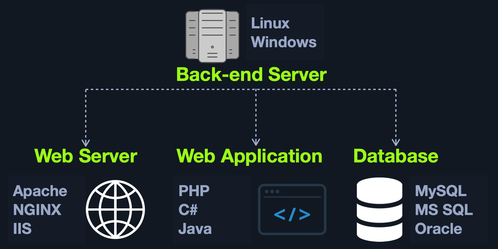

# Back End Servers — Learning

A `Back End Server` is the physical or virtual system that hosts the components required to run a web application.

It provides:

- Hardware resources
- Operating system
- Application processes
- Backend services

The backend server is responsible for executing the tasks required by the web application.

---

## Software

A backend server commonly hosts three main components:

- `Web Server`
- `Database`
- `Development Framework`



It may also contain:

- Hypervisors
- Containers
- `WAF`
- Additional backend services

---

## Common Web Stacks

A `stack` is a combination of technologies commonly used together to host a web application.

| Stack | Components |
| --- | --- |
| `LAMP` | `Linux`, `Apache`, `MySQL`, `PHP` |
| `WAMP` | `Windows`, `Apache`, `MySQL`, `PHP` |
| `WINS` | `Windows`, `IIS`, `.NET`, `SQL Server` |
| `MAMP` | `macOS`, `Apache`, `MySQL`, `PHP` |
| `XAMPP` | Cross-platform, `Apache`, `MySQL`, `PHP/PERL` |

---

## Hardware

The backend server provides the hardware resources required by the application.

Important resources include:

- CPU
- RAM
- Storage
- Network capacity

These resources directly affect the application's performance, stability, and responsiveness.

Large applications may distribute workloads across multiple backend servers.

Example:

```text
Users
  ↓
Multiple Back End Servers
  ↓
Application / Database Services
```

Backend infrastructure may be hosted using:

- Physical servers
- Virtual machines
- Data centers
- Cloud infrastructure
- Virtual hosts

Large web applications commonly distribute their workload across several servers rather than relying on a single backend system.

